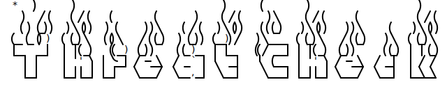

# ThreatCheck

 

ThreatCheck is a malware-analysis tool that identify the exact position and details of malicious content in binary files using external Anti-Virus scanners. **Different from the <a href="#original">two original projects</a>, all AV scanners are supported if appropriately configured.**

Takes a binary as input, splits it until it pinpoints that exact bytes that the target engine will flag on and prints them to the screen. This can be helpful in confirming AV scan results and furthering investigation when analyzing malware.
<div id="original"></div>

>  idea from [DefenderCheck](https://github.com/matterpreter/DefenderCheck) and [ThreatCheck](https://github.com/rasta-mouse/ThreatCheck)

## Installation

-  Run `go build` under the root directory of the project.

-  Or directly run the compiled binaries in [Releases](https://github.com/PACHAKUTlQ/ThreatCheck/releases).


## Usage

-  Edit `config.yaml` to configure external scanners. Supports all kinds of CLI scanners. If no `config.yaml` found in the current directory, a template will be generated.

`config.yaml`:

```yaml
scanners:
  # - name: "AV name"
  #   scanCmd: "Command for scanning the target file. Use {{file}} as the file name to be scanned. The scanner executable is STRONGLY RECOMMENDED to be in PATH."
  #   posOutput: "A string in output of positive detection but not in negative"
  - name: "ESET"
    scanCmd: "ecls /clean-mode=none /no-quarantine {{file}}"
    posOutput: ">"
  - name: "Windows Defender"
    scanCmd: "MpCmdRun.exe -Scan -ScanType 3 -File {{file}} -DisableRemediation -Trace -Level 0x10"
    posOutput: "Threat information"
  # - name: "Any others"
```

-  Note that the scanner executable is **STRONGLY RECOMMENDED to be added into PATH** due to possible spaces in the absolute path of the scanner
-  `./ThreatCheck -h` for help information
-  `./ThreatCheck -f <target_file>` for scanning a file


## Example

```console
$ ./ThreatCheck -f D:/fakepath/mimikatz.sfx.exe
```
```plaintext
  *   )      )                          )     (        )                   )
    )  /(   ( /(   (       (       )   ( /(     )\    ( /(     (          ( /(
   ( )(_))  )\())  )(     ))\   ( /(   )\())  (((_)   )\())   ))\    (    )\())
  (_(_())  ((_)\  (()\   /((_)  )(_)) (_))/   )\___  ((_)\   /((_)   )\  ((_)\
  |_   _|  | |(_)  ((_) (_))   ((_)_  | |_   ((/ __| | |(_) (_))    ((_) | |(_)
    | |    | ' \  | '_| / -_)  / _` | |  _|   | (__  | ' \  / -_)  / _|  | / /
    |_|    |_||_| |_|   \___|  \__,_|  \__|    \___| |_||_| \___|  \__|  |_\_\

==================================================================================
Scanning with ESET

Report for the whole file:

...
/clean-mode=none /no-quarantine D:/fakepath/mimikatz.sfx.exe
D:/fakepath/mimikatz.sfx.exe Win64/Riskware.Mimikatz.G
D:/fakepath/mimikatz.sfx.exe > WINRARSFX > mimikatz.exe
...

Details:

0004fb99  31 1c  31 20  31 24  31 28  31 2c  31 30  31 34  31 38  1·1 1$1(1,101418
0004fba9  31 3c  31 40  31 44  31 48  31 4c  31 50  31 54  31 58  1<1@1D1H1L1P1T1X
0004fbb9  31 5c  31 60  31 64  31 68  31 6c  31 70  31 74  31 78  1\1`1d1h1l1p1t1x
0004fbc9  31 7c  31 80  31 88  31 8c  31 90  31 94  31 98  31 9c  1|1·1·1·1·1·1·1·
0004fbd9  31 00  00 00  00 00  00 00  00 00  00 00  00 00  00 00  1···············
0004fbe9  00 00  00 00  00 00  00 00  00 00  00 00  00 00  00 00  ················
0004fbf9  00 00  00 00  00 00  00 52  61 72  21 1a  07 01  00 69  ·······Rar!····i
0004fc09  39 b1  8a 0c  01 05  08 00  07 01  01 b1  9d a1  80 00  9···············
0004fc19  c7 01  ba 7b  2e 02  03 0b  ed 9c  a1 80  00 04  80 dc  ···{.···········
0004fc29  d2 80  00 20  38 c7  f0 6f  80 23  00 0c  6d 69  6d 69  ··· 8··o·#··mimi
0004fc39  6b 61  74 7a  2e 65  78 65  0a 03  02 09  61 a3  ba 3e  katz.exe····a··>
0004fc49  cc d8  01 8d  61 ec  5a 70  86 54  54 32  24 50  60 58  ····a·Zp·TT2$P`X
0004fc59  77 bb  97 60  58 17  25 d8  10 58  75 d9  8c 71  8a 0b  w··`X·%··Xu··q··
0004fc69  91 60  bc 91  82 b7  64 b8  17 09  70 22  c1 08  a0 a4  ·`····d···p"····
0004fc79  50 46  3d 38  c6 17  02 08  2a 0d  82 96  ed bc  5c c4  PF=8····*·····\·
0004fc89  ce 61  9c e6  66 71  c7 3a  5e 67  1c c5  73 1e  80 17  ·a··fq·:^g··s···

Malicious content detected at: 0004fc19 (326681 bytes)
```


## Warning

-  This tool reads from a potentially malicious file and split it into pieces of temp files. The behavior of frequently writing malicious content into temp directory **can be taken as highly risky** by some Anti-Viruses. Hence, the tool may be marked as malware, which is a **false positive**. If met with this case, please add the executable into the AV exclusion list.

-  This is a **completely open-source** project, and you can view all the source code to confirm it is harmless.
-  This tool is designed to and should only be used for **security researches** and malware analysis. Any misuse of this tool in malicious activities is highly prohibited, and this tool takes no responsibility for any consequences of it.
